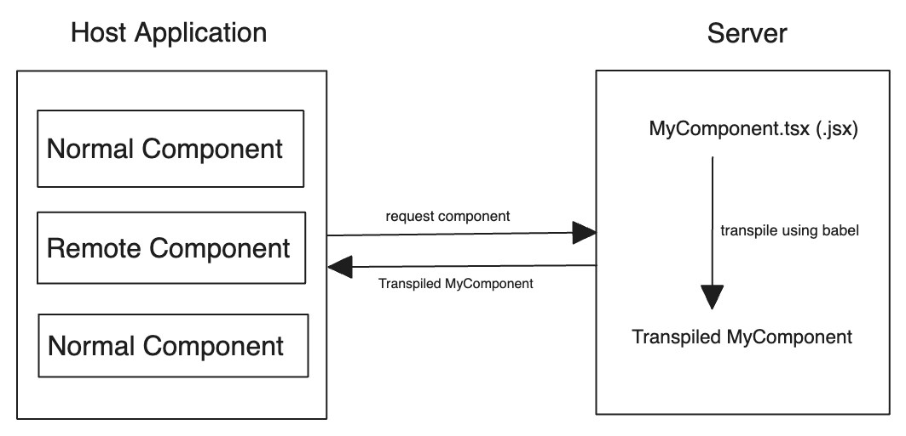

# react-native-server-component

Server Component allow react-native (Host) applications to render remote (Server) components. Remote components are loaded through URI at runtime. Remotely loaded components behaves similar to the locally imported components.

## Installation

```sh
npm install react-native-server-component
```

## Usage

### Server Component

```tsx
// Host Application Component using ServerComponent

import React from 'react';
import { View } from 'react-native';
import { ServerComponent } from 'react-native-server-component';

const FallbackComponent = () => {
  return (
    <View>
      <Text> Fallback Component </Text>
    </View>
  );
};

export default function App() {
  return (
    <View style={{ flex: 1 }}>
      <ServerComponent
        source={{ uri: 'http://10.0.2.2:8080/home-component' }}
        fallbackComponent={<FallbackComponent />}
      />
    </View>
  );
}
```

```tsx
// Server Component hosted on server

export const HomeComponent = () => {
  return (
    <View>
      <Text> Server Component </Text>
    </View>
  );
};
```

### Pre Load Component

```tsx
import React from 'react';
import { View } from 'react-native';
import { ServerComponent } from 'react-native-server-component';

const { preload } = preloadServerComponent({});
(async () => {
  try {
    await preload('http://10.0.2.2:8080/detail-component');
  } catch (e) {
    console.error('Failed to preload. ', e);
  }
})();

export default function App() {
  return (
    <View style={{ flex: 1 }}>
      <ServerComponent
        source={{ uri: 'http://10.0.2.2:8080/detail-component' }}
        fallbackComponent={<FallbackComponent />}
      />
    </View>
  );
}
```

## How does it work?



## Props

- `source`
  - URI to fetch component source
- `fallbackComponent`
- `errorComponent`
  - Component to be used in case of error in ServerComponent
- `loadingComponent`
- `onAction`
  - Callback with `action` and `payload`. Current supported actions are `NAVIGATE`, `IO`.

## Handling Actions on Server Component

Server Component is capable of handling all the user interactions. They can emit event to let host application know about actions, host application needs to implement `onAction` callback provided by Server Component.

```tsx
// Host application

const handleAction = useCallback(
  (action: string, payload: Record<string, any>) => {
    switch (action) {
      case 'NAVIGATE':
        navigation.navigate(payload.route);
        break;
    }
  },
  [navigation]
);

<ServerComponent
  source={{ uri: 'http://10.0.2.2:8080' }}
  fallbackComponent={<FallbackComponent />}
  onAction={handleAction}
/>;
```

Action emitted contains action type and payload.

```tsx
// Example Server Component

const ExampleServerComponent = ({
  onAction,
}: {
  onAction: (action: any, payload: Record<string, any>) => void;
}) => {
  const onPress = useCallback(() => {
    if (onAction) {
      onAction('NAVIGATE', { route: 'DetailsScreen' });
    }
  }, [onAction]);

  return (
    <View>
      <Pressable onPress={onPress}>
        <View>
          <Text> {`Navigation`} </Text>
        </View>
      </Pressable>
    </View>
  );
};
```

## Component Caching

Server Components are cached in-memory for URI. Internally axios is used to fetch source from URI. `Cache-Control` header in response is used for cache burst in app session.

## Running example app

TODO:: Add documentation

## Contributing

See the [contributing guide](CONTRIBUTING.md) to learn how to contribute to the repository and the development workflow.

## License

MIT

---

Made with [create-react-native-library](https://github.com/callstack/react-native-builder-bob)
